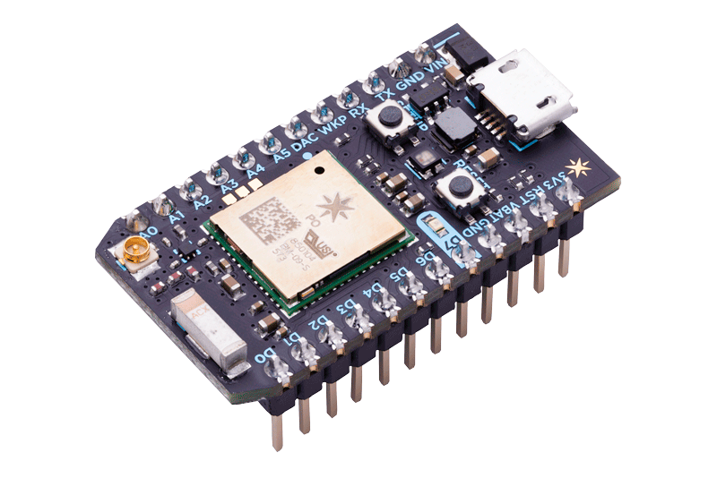

# IoT  

## Mikä IoT?  
* Internet of Things eli IoT tarkoittaa esineiden liittämistä internettiin ja keräämään dataa.  
* IoT:n tarkoituksena on yhdistää kodinkoneita puhelimiin ja tietokoneisiin jolla niitä voidaan ohjata.  
IoT
1. ***Sensorit***, jolla kerätään dataa
2. ***Datan lähettäminen***, pilvipalveluun internetin välityksellä
3. ***Datan prosessointi***
4. ***Käyttöliittymä***, jolla nähdään tulokset


## Sääasemajärjestelmän toimintakaavio  

### Laitteistot 
**Particle Photon** : 

* USB portti, josta photoni saa virran
* 5 Analogista ja 7 digitaalista pinniä
* Particle CLoud ympäristö
### Komponentit  
### **Anturit**
***Kuulevat anturit*** kuulevat ja tunnistavat erillaisia ääniä, niiden voimakkuutta sekä taajuutta.  
* Kuulevia antureita voi asentaa tienvarsiin seuraamaan ohimenevien autojen määrää ja ajoneuvon tyyppiä.
* Kuulevilla antureilla voidaan tehdä ohjelma, joka tunnistaa aseen laukauksen tai lasin rikkoutumisen ja tällä tiedolla paikalle voidaan lähettää apua.

***Tuntevat anturit*** havaitsee liikettä, kosteutta, lämpöä ja painoa.  
* Eläimen hyvinvointia voi tarkkailla tunto anturilla, jos esimerkiksi lehmään kytkettävä anturi seuraa lehmän kävelyn määrää ja hännän liikettä selvittääkseen lehmän hyvinvoinnin.  
* Antureita voi myös hyödyntää rakennusten terveyden seuraamiseen kosteutta mittaavalla anturilla ja voidaan estää isomman vahingon sattumista puutaloihin.

***Haistavat anturit*** tunnistaa niille määrättyjä hajuja kuten hometta tai polttoaineen rikkipitoisuuksia. Haistavat anturit yhdistävät biologiaa ja elektroniikkaa. Anturit ei kummiskaan pysty vielä tunnistamaan kaikkia hajuja.
* Haistavat anturit havaitsevat homeen ennen ihmistä, joka voi auttaa leviämisen estämiessä.  
* Haistavilla antureilla tutkitaan myös merialusten polttoaineen rikkipitoisuuksia.

***Näkevät anturit*** näkee mitä ihmissilmäkin näkee. Jotkin anturit voivat nähdä jopa paremmin.
* Näkevää anturia on käytetty myös robottikourassa, joka seuraa biomassan laatua.  
* Näkeviä antureita voidaan käyttää liiketunnistimissa valojen sytyttämiseen rakennuksissa ja jos havaitsee epäilyttävää liikettä niin hälyttää siitä.
* Kognitiivinen konenäkö oppii tunnistamaa erillaisia virheitä toistojen jälkeen.

#### **DHT11 Sensori**
  
**DHT11** on halpa kosteutta ja lämpötilaa mittaava sensori. Se kerää ja lähettää datan ***Photonille*** jota hyödynnimme sääasemassa.

### Palvelut  
Sääasema hyödyntää Microsoft Azuren pilvipalvelua.  

Pilvipalvelujen hyviä puolia on tietojen säilyvyys ja helppo käyttöisyys.  

Huonoja puolija taas ovat tietoturva riskit.  
 
Sääaseman ohjelmointi
### Toiminta  
## Käytetyt kehitysympäristöt  
particle pilvikonsoli 
replit:llä tehtiin käyttöliittymä sääasemalle
Käytettiin Azurea triggereiden tekemiseen
Version control githubiin
## Ohjelmointi 
Photoniin ohjelmoitu koodi 
````
#include <Adafruit_DHT_Particle.h>

#define DHTPIN D2
#define DHTTYPE DHT11

double temperature;
double humidity;

int led1 = D6; 

DHT dht(DHTPIN, DHTTYPE);


void setup() {
  dht.begin();
  Particle.variable("temperature", temperature);
  Particle.variable("humidity", humidity);
  pinMode(led1, OUTPUT);
  Particle.function("led",ledToggle);
  digitalWrite(led1, LOW);
  

}


void loop() {

  float h = dht.getHumidity();
  float t = dht.getTempCelcius();
  temperature=t;
  humidity=h;

  if(isnan(h) || isnan(t)) {

    Serial.println("Failed to read from DHT sensor!");
    return;
  }
  
  String data = String::format("{\"Hum(\%)\": %4.2f, \"Temp(°C)\": %4.2f, \"DP(°C)\": %4.2f, \"HI(°C)\": %4.2f}", h, t);
  Particle.publish("temperatureOskariK", data, PRIVATE);

  delay(60000);
}
int ledToggle(String command) {

    if (command=="on") {
        digitalWrite(led1,HIGH);
        return 1;
    }
    else if (command=="off") {
        digitalWrite(led1,LOW);
        return 0;
    }
    else {
        return -1;
    }
}
````
Azurella tehty trigger joka tallentaa datan tietovarastoon  
````
#r "Newtonsoft.Json" 
using System; 
using System.Net; 
using System.Threading.Tasks;
using Newtonsoft.Json; 
 
public static async Task<HttpResponseMessage> Run(HttpRequestMessage req, ICollector<DeviceDataWrapper> outputTable, TraceWriter log)
{
    string deviceId = req.GetQueryNameValuePairs() 
        .FirstOrDefault(q => string.Compare(q.Key, "deviceid", true) == 0)
        .Value;
    string devData = req.GetQueryNameValuePairs() 
        .FirstOrDefault(q => string.Compare(q.Key, "data", true) == 0)
        .Value;
    devData = WebUtility.UrlDecode(devData); 
    devData = devData.Replace("()", ""); 
    devData = devData.Replace("(°C)", ""); 

    DeviceDataWrapper deviceData = JsonConvert.DeserializeObject<DeviceDataWrapper>(devData); 
    deviceData.DeviceId = deviceId; 

    deviceData.PartitionKey = deviceId; 
    log.Info("deviceData: " + deviceData); 
    Guid id = Guid.NewGuid(); 
    deviceData.RowKey = id.ToString(); 
    outputTable.Add(
        deviceData 
    );

    return req.CreateResponse(HttpStatusCode.OK, "Hello "); 
}


public class DeviceDataWrapper {
    public string PartitionKey { get; set; }
    public string DeviceId { get; set; }
    public string RowKey { get; set; }
    public string Hum { get; set; }
    public string Temp { get; set; }
}

````
Toinen Azuren trigger joka tekee säilötystä datasta JSON rajapinnan käyttöliittymään
````
#r "Newtonsoft.Json"
#r "Microsoft.WindowsAzure.Storage"
using Microsoft.WindowsAzure.Storage.Table;
using System.Net;
using System.Text;
using Newtonsoft.Json;

public static async Task<HttpResponseMessage> Run(HttpRequestMessage req, [Table("IoTData", "DeviceData")] IQueryable<IotData> inputTable, TraceWriter log)
{
    log.Info("C# HTTP trigger function processed a request.");
    string amount = req.GetQueryNameValuePairs()
        .FirstOrDefault(q => string.Compare(q.Key, "amount", true) == 0)
        .Value;
    int max = 0;
    Int32.TryParse(amount, out max); 
    log.Info("määrä: " + max);
    string deviceId = req.GetQueryNameValuePairs()
        .FirstOrDefault(q => string.Compare(q.Key, "deviceId", true) == 0)
        .Value;


        List<IotData> iotDatas = new List<IotData>();
        List<IotData> orderedDatas = inputTable.Where(p => p.PartitionKey == deviceId).ToList();
        log.Info("count: " + orderedDatas.Count);
        int count = 1;
        foreach (IotData row in orderedDatas.OrderByDescending(o => o.Timestamp))
        {
                iotDatas.Add(row);
                if (max > 0 && count++ >= max)
                {
                    break;
                }
        }

        string jsonRet = JsonConvert.SerializeObject(iotDatas);
        return new HttpResponseMessage(HttpStatusCode.OK) {
        Content = new StringContent(jsonRet, Encoding. UTF8, "application/json")
        };
}

public class IotData : TableEntity
{
    public string DeviceId { get; set; }
    public string Hum { get; set;}
    public string Temp { get; set;}

}

````
Käyttöliittymän koodi
````
import React, { useState} from 'react';
import './App.css';
import Chart from "react-google-charts";
import Header from './components/layout/Header';
import Footer from './components/layout/Footer';
import Portfolio from './components/Portfolio';
import { BrowserRouter as Router, Route, Switch } from 'react-router-dom';

function App() {
  const initWeather = [];
  const [weather, setWeather] = useState(initWeather);

  function convertUTCDateToLocalDate(date) {
    new Date(date.getTime() + date.getTimezoneOffset()*60*1000);
    return date;
  }

let chartHumData = [
  ['Aika', '%'],
  ['Please wait...', 0]
];
let chartTempData = [
  ['Aika', 'Asteet'],
  ['Please wait...', 0]
];

  fetch('https://oppilas-9.azurewebsites.net/api/HttpTriggerCSharp2?code=UTGr5V7/25tVhjuNFr4ujXvJZYHkVzQ80odzBoStbxhcmmnqtWP2lw==&deviceId=2f0035001947393035313138&amount=5')
    .then(response => response.json())
    .then(json => setWeather([...json]));
  
  let humtempkey = 1;

  const rows = () => weather.map(temphum => {
  
  if(chartHumData[1][0] === 'Please wait...'){
    chartHumData.pop();
  if(chartTempData[1][0] === 'Please wait...')
    chartTempData.pop();
  }
  
  chartHumData.push([String(convertUTCDateToLocalDate(new Date(temphum.Timestamp))).split(' ')[4], parseInt(temphum.Hum)])
   chartTempData.push([String(convertUTCDateToLocalDate(new Date(temphum.Timestamp))).split(' ')[4], parseInt(temphum.Temp)])

  return <div key={humtempkey++}>
    <b>Klo:</b> {String(convertUTCDateToLocalDate(new Date(temphum.Timestamp))).split(' ')[4]} &nbsp;
    <b>Ilmankosteus:</b> {temphum.Hum} % &nbsp;
    <b>Lämpötila:</b> {temphum.Temp} °C 
  </div>
  }) 
  return (
    <Router>
      <div className="App">
      <Header />
      <Switch>
         <Route path="/portfolio">
            <Portfolio />
        </Route>
        <Route path="/">
          {rows()}
          <div>
            <Chart
              width={2000}
              height={400}
              chartType="ColumnChart"
              loader={<div>Loading Chart</div>}
              data={chartHumData}
              options={{
                title: 'Ilmankosteus',
                chartArea: { width: '50%' },
                vAxis: { minValue: 0 }, 
              }}
            />
          </div>
          <div>
            <Chart
              width={2000}
              height={400}
              chartType="LineChart"
              loader={<div>Loading Chart</div>}
              data={chartTempData}
              options={{
                title: 'Lämpötila',
                chartArea: { width: '50%' },
                vAxis: { minValue: 0 },
              }}
            />
             <a href="https://github.com/OskariKiikonen/HyTeIoT/blob/master/README.md" target="_BLANK" rel="noopener noreferrer"> Projektin README</a>
          </div>
        </Route>
      </Switch>
      <Footer />
    </div>
  </Router>
  );
}
export default App;
````
## Termihakemisto  
Particle Photon = IoT kehityskortti  
DHT11 = lämpöä ja ilmankosteutta mittaava sensori  
Microsoft AZURE = Pilvipalvelu  
## Viitteet  
https://fi.wikipedia.org/wiki/Esineiden_internet  
https://www.youtube.com/watch?v=m6eExiGqtS0  
https://www.youtube.com/watch?v=nzg_x1-EFpc&list=PLtbOrywM-BA8qzTn5fkzhlcaR3d92HYO7  
https://www.youtube.com/watch?v=2p7V_6WzVOw&list=PLtbOrywM-BA8qzTn5fkzhlcaR3d92HYO7  
https://www.dna.fi/yrityksille/aistien-internet-podcast