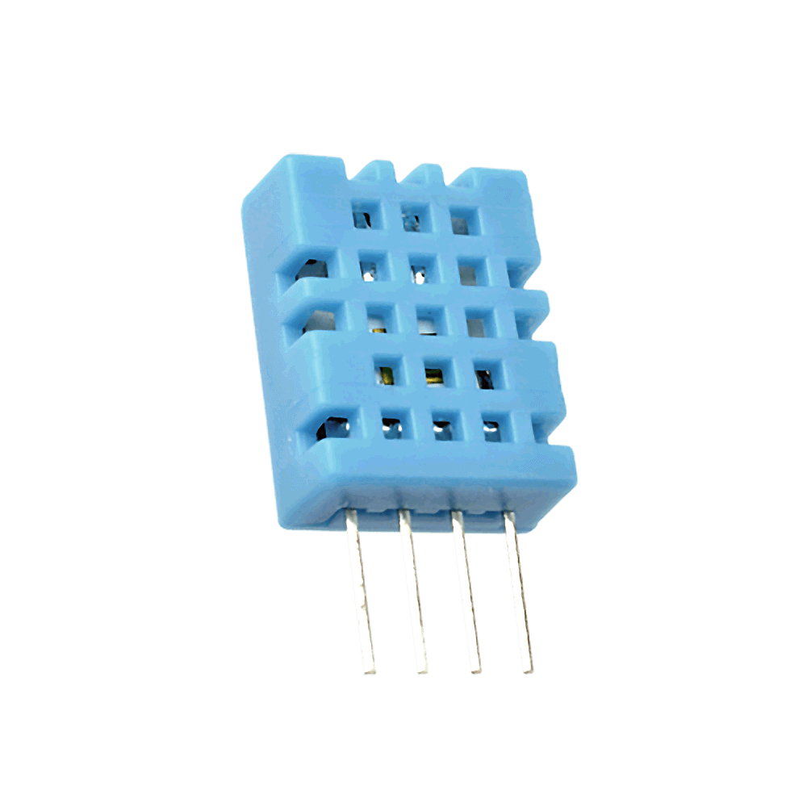

# IoT  

## Mikä IoT?  
* Internet of Things eli IoT tarkoittaa esineiden liittämistä internettiin j keräämään dataa.  
* IoT:n tarkoituksena on yhdistää kodinkoneita puhelimiin ja tietokoneisiin jolla niitä voidaan ohjata.  
IoT
1. ***Laitteet***, jolla kerätään dataa
2. ***Datan lähettäminen***, n pilvipalveluun internetin välityksellä
3. ***Datan prosessointi***
4. ***Käyttöliittymä***, jolla nähdään tulokset

## Sääasemajärjestelmän toimintakaavio  

### Laitteistot  
### Komponentit  
### **Anturit**
***Kuulevat anturit*** kuulevat ja tunnistavat erillaisia ääniä, niiden voimakkuutta sekä taajuutta.  
* Kuulevia antureita voi asentaa tienvarsiin seuraamaan ohimenevien autojen määrää ja ajoneuvon tyyppiä.
* Kuulevilla antureilla voidaan tehdä ohjelma, joka tunnistaa aseen laukauksen tai lasin rikkoutumisen ja tällä tiedolla paikalle voidaan lähettää apua.

***Tuntevat anturit*** havaitsee liikettä, kosteutta, lämpöä ja painoa.  
* Eläimen hyvinvointia voi tarkkailla tunto anturilla, jos esimerkiksi lehmään kytkettävä anturi seuraa lehmän kävelyn määrää ja hännän liikettä selvittääkseen lehmän hyvinvoinnin.  
* Antureita voi myös hyödyntää rakennusten terveyden seuraamiseen kosteutta mittaavalla anturilla ja voidaan estää isomman vahingon sattumista puutaloihin.

***Haistavat anturit*** tunnistaa niille määrättyjä hajuja kuten hometta tai polttoaineen rikkipitoisuuksia. Haistavat anturit yhdistävät biologiaa ja elektroniikkaa. Anturit ei kummiskaan pysty vielä tunnistamaan kaikkia hajuja.
* Haistavat anturit havaitsevat homeen ennen ihmistä, joka voi auttaa leviämisen estämiessä.  
* Haistavilla antureilla tutkitaan myös merialusten polttoaineen rikkipitoisuuksia.

***Näkevät anturit*** näkee mitä ihmissilmäkin näkee. Jotkin anturit voivat nähdä jopa paremmin.
* Näkevää anturia on käytetty myös robottikourassa, joka seuraa biomassan laatua.  
* Näkeviä antureita voidaan käyttää liiketunnistimissa valojen sytyttämiseen rakennuksissa ja jos havaitsee epäilyttävää liikettä niin hälyttää siitä.
* Kognitiivinen konenäkö oppii tunnistamaa erillaisia virheitä toistojen jälkeen.

#### **DHT11 Sensori**
  
**DHT11** on halpa kosteutta ja lämpötilaa mittaava sensori. Se kerää ja lähettää datan ***Photonille*** jota hyödynnimme sääasemassa.

### Palvelut  
Sääasema hyödyntää Microsoft Azuren pilvipalvelua.  

Pilvipalvelujen hyviä puolia on tietojen säilyvyys ja helppo käyttöisyys.  

Huonoja puolija taas ovat tietoturva riskit.  

### Ohjelmointi  
### Toiminta  
## Käytetyt kehitysympäristöt  
## Termihakemisto  
Particle Photon = IoT kehityskortti  
DHT11 = lämpöä ja ilmankosteutta mittaava sensori  
Microsoft AZURE = Pilvipalvelu  
## Viitteet  
https://fi.wikipedia.org/wiki/Esineiden_internet  
https://www.youtube.com/watch?v=m6eExiGqtS0  
https://www.youtube.com/watch?v=nzg_x1-EFpc&list=PLtbOrywM-BA8qzTn5fkzhlcaR3d92HYO7  
https://www.youtube.com/watch?v=2p7V_6WzVOw&list=PLtbOrywM-BA8qzTn5fkzhlcaR3d92HYO7  
https://www.dna.fi/yrityksille/aistien-internet-podcast